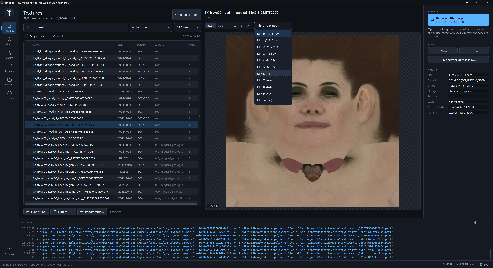
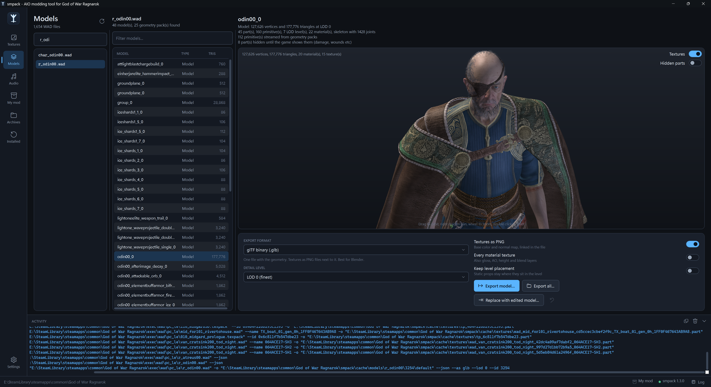
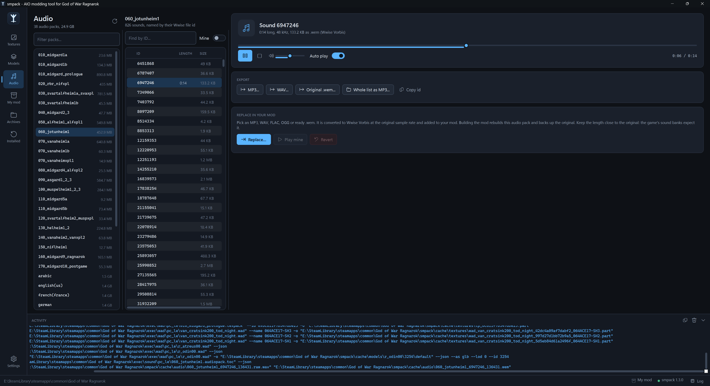
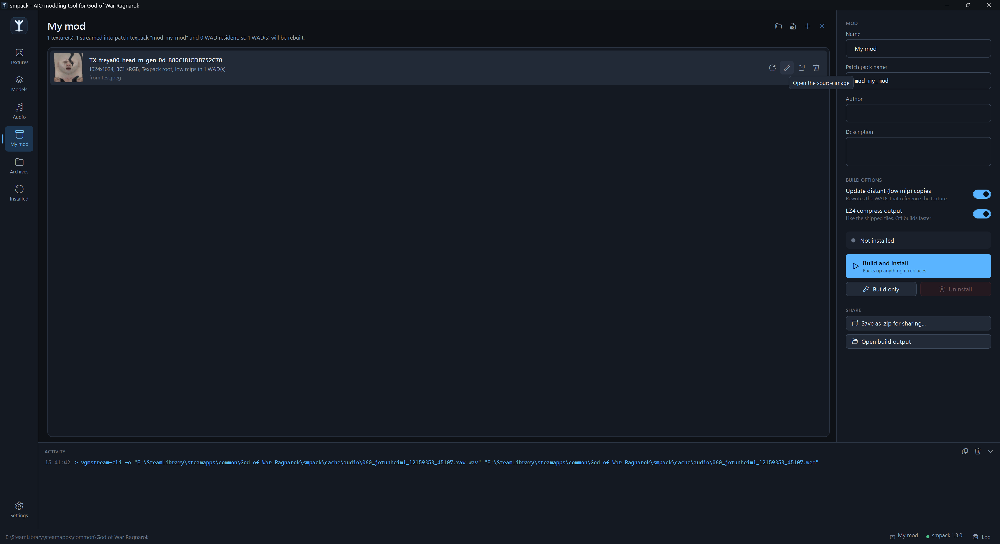
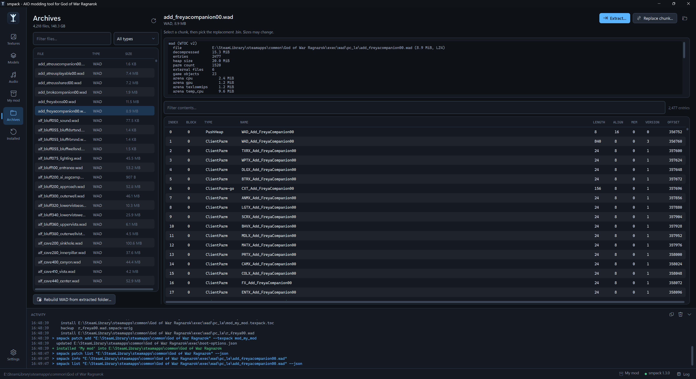
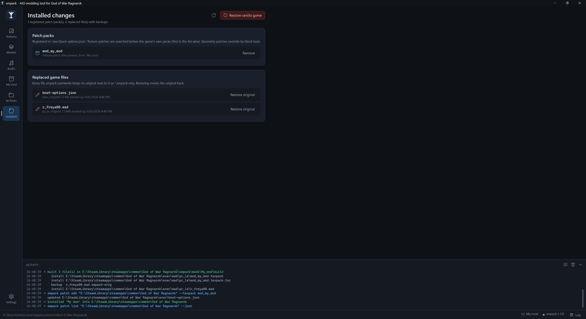

<p align="left">
  
</p>

---

# smpack - God of War Ragnarök AIO modding tool

[](https://github.com/iArtorias/smpack/releases)

> Browse, export and replace the textures, models and sounds of God of War Ragnarök and
> package the changes as a mod you can install, share and remove.

> [!IMPORTANT]
> smpack works on your own installed copy of the game. No game data is included in this
> repository or in the releases.

> [!CAUTION]
> Mods change game files. smpack backs up everything it overwrites, but keep your own backup of
> the game folder before you install mods, and only share your own work.

---

## Overview

**smpack** reads the packed formats of the installed game (WADs, texture packs, geometry packs,
animation sets, shaders and audio packs) and writes them back in the form the engine expects.
The original multi gigabyte packs are never edited. Streamed textures and geometry go into
small patch packs that the game loads before its own, and every file smpack does overwrite is
kept next to the original as `<name>.smpack-orig`.

---

## Components

### `SmpackGui.exe`
> The desktop app. Pick a texture, model or sound, replace it with your own file, then build
> and install your mod with one click.

### `smpack.exe`
> The command line tool the app runs. Use it for scripting, batch work and formats the app does
> not cover. See [smpack/README.md](smpack/README.md).

---

## Screenshots

<table>
  <tr>
    <td align="center"><b>Textures</b><br><a href="images/screenshot-textures.png"></a></td>
    <td align="center"><b>Models</b><br><a href="images/screenshot-models.png"></a></td>
  </tr>
  <tr>
    <td align="center"><b>Audio</b><br><a href="images/screenshot-audio.png"></a></td>
    <td align="center"><b>My mod</b><br><a href="images/screenshot-my-mod.png"></a></td>
  </tr>
  <tr>
    <td align="center"><b>Archives</b><br><a href="images/screenshot-archives.png"></a></td>
    <td align="center"><b>Installed</b><br><a href="images/screenshot-installed.png"></a></td>
  </tr>
</table>

| Page | What it does |
|---|---|
| Textures | Search about 62000 named textures, preview them (mips, cube faces, channels, HDR exposure) and replace them with PNG, TGA, JPG, BMP, TIFF, HDR, EXR or DDS |
| Models | 3D preview of every model in a WAD, export to `.glb`, `.gltf` or `.fbx`, and replace a model with an edited glTF |
| Audio | Play every Wwise sound, export to MP3, WAV or `.wem`, and replace sounds with MP3, WAV, FLAC, OGG or `.wem` |
| My mod | Your mod project: everything you replaced, build, install, uninstall and save as `.zip` |
| Archives | Inspect, extract and rebuild WADs, swap chunks, animation sets, shaders, audio streams and geometry blocks |
| Installed | Patch packs and replaced files in the game, with restore of single files or the whole game |
| Settings | Game folder, external tools (texconv, vgmstream, Wwise), cache and encoding quality |

---

## Requirements

- Windows 10 or 11, x64
- [.NET 8 Desktop Runtime](https://dotnet.microsoft.com/download/dotnet/8.0) (x64)
- Installed **God of War Ragnarök** for PC (*Steam*, *Epic*)
- 1-2 GB of free space for the preview cache and mod builds
- **texconv** to convert images. The app downloads it from *Settings*. Ready made DDS files work
  without it.
- **vgmstream** to play and export sounds (also downloaded from *Settings*), and **Audiokinetic
  Wwise** to encode your own audio. Ready made `.wem` files work without Wwise.

---

## Usage

### 1. Download the latest release

Get the latest binaries from the [Releases](https://github.com/iArtorias/smpack/releases) page.
Unzip it anywhere outside the game folder and run `SmpackGui.exe`.

### 2. Point it at the game

smpack looks for the game on first launch. If it is not found, open **Settings > Game folder**
and pick the folder that contains `GoWR.exe`. While you are there, click **Tools > texconv >
Download**.

### 3. Build the texture index

On the **Textures** page click **Build texture index**. It reads every WAD to learn the texture
names and takes 1-3 minutes on HDD. You only need to repeat it after a game update.

### 4. Replace something

- **Texture:** select it, then click **Replace with image...** or drag your image onto the
  preview. Check the comparison, pick the output size and click **Add to my mod**.
- **Model:** export it, edit it, then click **Replace with edited model...** on the same model
  (see [Models](#models)).
- **Sound:** select it on the **Audio** page and click **Replace...**.

The first replacement asks for a mod name. Everything after that goes into the same mod.

### 5. Install and play

On **My mod** click **Build and install**, then start the game. **Uninstall** on the same page
removes the mod again.

---

## Textures

Use **Export > PNG...** to get the original at full resolution, edit it and replace the texture
with the result. Keeping the same size and layout keeps the UVs aligned.

| Output size | When to use it |
|---|---|
| Original size | Default, always safe |
| Double, Half | Same aspect ratio. Streamed textures can go up to 8K |
| Your image's size | Keep the original aspect ratio or the texture will stretch |

The output format is always the one the game texture uses (shown under *Details*):

| Format | Content | Notes |
|---|---|---|
| BC1, BC7 sRGB | Color | Edit like any picture |
| BC7, BC5 linear | Normal maps | BC5 keeps only red and green. Turn on *Rebuild normal Z* to preview it |
| BC4 | Gloss, AO, masks | Only the red channel is used |
| BC6H | HDR skies, light probes | Use HDR or EXR sources |
| Volume, cube, array | Probes, reflections | Replace with a DDS of the same layout. Export the original as DDS for a template |

To edit many textures at once, select them, **Export PNG**, edit the files without renaming
them, then **Import folder...**. Files that do not match a texture name are skipped. If you
change a source image later, click **Re-convert** next to it on **My mod**.

---

## Models

Pick a WAD, then a model, to preview it (drag to orbit, right drag to pan, wheel to zoom,
double click to reset). Export formats:

- `.glb` - one file, best for Blender (*File > Import > glTF 2.0*)
- `.gltf` + `.bin` - JSON plus a buffer
- `.fbx` (7.4 binary) - for Autodesk tools and game engines

An export holds positions, normals, every UV set, vertex colours, one object per model part and
one material per game material (`MAT_<hash>`). Jointed models come with their skeleton and skin
weights. Base color and normal maps are written as PNG to a `textures` folder, with cutout maps
(hair, lashes, foliage) in the alpha channel. Units are metres, Y up.

> [!NOTE]
> - **Hidden parts.** Many characters carry parts the game only shows when needed: wounds,
>   bruises, arrows, damage states. They are left out unless **Hidden parts** is on.
> - **Variants.** Some models (for example `bandit00_0`) hold several looks of the same enemy.
>   Pick one in the list above the preview, the export uses the selected one.
> - **Layered materials.** Skin, hair and cloth are tinted in game by layered materials, so the
>   exported color map can look plainer than in game.

### Replacing a model

1. Export the model as `.glb` or `.gltf` (LOD 0).
2. Edit it in Blender or another tool. Keep the object names (`<model>_part<N>`) and material
   names (`MAT_<hash>`). Blender's `.001` suffixes are ignored.
3. Export back to glTF with the default settings.
4. Select the same model in smpack and click **Replace with edited model...**.

You can add or remove vertices, change UVs and reshape the mesh. Skinned parts keep the weights
from the file, parts without weights take them from the nearest original vertex. The new mesh
is written into every LOD, so it does not pop back to the original at a distance.

> [!WARNING]
> Only glTF can be imported, and parts, materials and the skeleton must stay the same. Meshlet
> and tessellated geometry has had less testing in game than plain meshes, and the placement
> bounds of static level props are not updated, so a much larger prop can disappear early.

---

## Audio

The **Audio** page lists the packs in `exec\sound\pc_le`: one per region, one per voice
language and a shared `root` pack. Sounds are named by their Wwise file ID.

- Select a sound to play it. Surround music is folded to stereo for listening.
- Export as MP3, WAV or the original `.wem`. **Whole list as MP3** exports everything shown, so
  filter first to export a subset.
- **Replace...** encodes your file with Wwise to Vorbis at the original sample rate.

> [!TIP]
> Keep replacements close to the original length. Sound banks store timing for many sounds
> (lip sync, music cues), so a much longer file can be cut off.

---

## Sharing and uninstalling

On **My mod** set a name, author and description, build, then click **Save as .zip for
sharing...**. The zip holds the built files laid out like the game folder plus a `README.txt`
for players. To install a shared mod by hand:

1. Back up `exec\boot-options.json` and every `.wad` file the zip contains.
2. Copy the zip's `exec` folder into the game folder, next to `GoWR.exe`.
3. Register the patch packs with `smpack patch add "<game folder>" --texpack <name> --lodpack <name>`
   or add them to `boot-options.json` as the included README shows.

---

## Troubleshooting

<details>
<summary><b>A replaced texture does not show in game</b></summary>

Check that the patch pack is listed on **Installed** with its files present. Distant objects use the small copy stored in the WADs, so keep *Update distant (low mip) copies* on. If several mods replace the same texture, the last one installed wins.

</details>

<details>
<summary><b>"Converting images needs texconv.exe"</b></summary>

Download it in **Settings > Tools**, or use a DDS with the right format and a full mip chain.

</details>

<details>
<summary><b>"Can't read ..." on a texture</b></summary>

Make sure **Settings > Tools** uses the bundled `smpack.exe` (version 1.3). If it still fails, copy the Activity log into a bug report.

</details>

<details>
<summary><b>The game was updated</b></summary>

Rebuild the texture index, then rebuild and reinstall your mods. Builds always start from the original files.

</details>

<details>
<summary><b>Antivirus flags texconv or smpack</b></summary>

Both are unsigned command line tools. texconv comes from Microsoft's DirectXTex releases, smpack is built from this repository.

</details>

<details>
<summary><b>Where are my files?</b></summary>

| What | Where |
|---|---|
| New mod projects | `<game>\smpack\mods` (changeable in *Settings*) |
| Texture index and preview cache | `<game>\smpack\cache` |
| Settings | `%APPDATA%\SmpackGui` |
| texconv and error log | `%LOCALAPPDATA%\SmpackGui` |
| Backups of game files | Next to the originals, as `*.smpack-orig` |

With *Keep the cache and new mods in the game folder* off (or a readonly game folder), `Documents\smpack mods` and `%LOCALAPPDATA%\SmpackGui\cache` are used instead.

</details>

---

## How it works

1. The original file is read from the game. If it was already modded, its backup is read
   instead, so changes never stack.
2. Images are encoded by texconv to the original's DXGI format with a full mip chain.
3. **Build** runs `smpack tex import`, `smpack mesh import` and `smpack audio replace`. Streamed
   data goes into patch packs, WAD resident data into copies of the original WADs.
4. **Install** copies the results into the game folder with backups and registers the patch
   packs in `exec\boot-options.json`. The engine looks in patch packs first.

---

## Compilation and dependencies

The app needs the **.NET 8 SDK** (Visual Studio 2022 is optional). The command line tool needs
a **C++23** compiler: MSVC 17.8+, GCC 13+ or Clang 17+.

```bat
:: Command line tool.
cd smpack
cmake -B build -DCMAKE_BUILD_TYPE=Release
cmake --build build --config Release
ctest --test-dir build -C Release

:: App (copy the built 'smpack.exe' to 'tools\smpack.exe' first)
build.cmd
```

- [`LZ4`](https://github.com/lz4/lz4) - Compression, BSD 2-Clause, in `smpack/third_party/lz4`
- [`DirectXTex`](https://github.com/microsoft/DirectXTex) - `texconv`, MIT, downloaded on demand
- [`vgmstream`](https://github.com/vgmstream/vgmstream) - Wwise decoding, ISC, downloaded on demand
- [Audiokinetic Wwise](https://www.audiokinetic.com/) - Audio encoding, through your own install
- Windows Media Foundation - MP3 encoding

---

## Disclaimer

> smpack is an unofficial fan tool by iArtorias, not affiliated with or endorsed by Santa Monica
> Studio or Sony Interactive Entertainment. *God of War* is a trademark of Sony Interactive
> Entertainment LLC. Use it on your own copy of the game and mod at your own risk.
